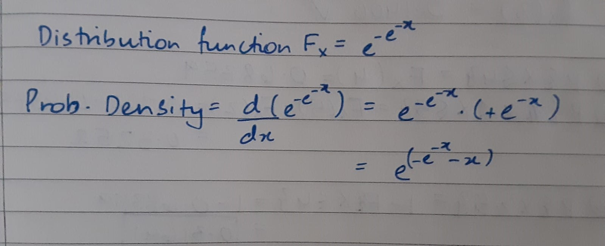
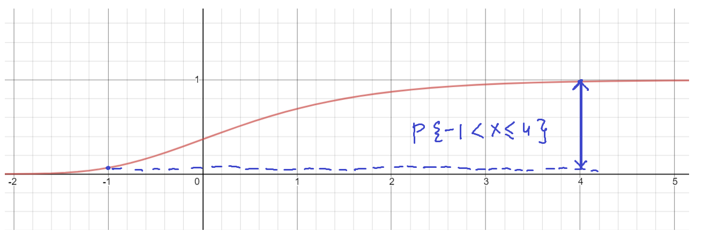
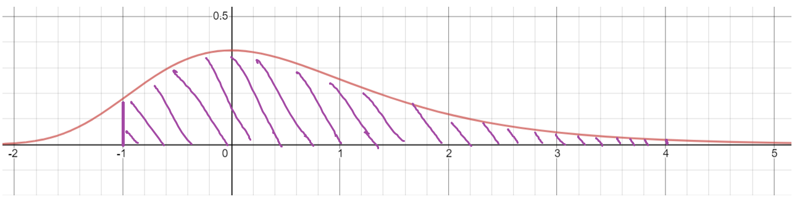

## g1-worksheet - Random Variables and Distribution Functions

1. A Gumbel random variable $X$ has distribution function $F_X(x) = \exp(-e^{-x}).$

(a) Give a graph of $F_X(x)$ and explain using this plot why $F_X$ is a valid cumulative probability distribution function.

This is a valid cumulative probability function because the y values range from 0 to 1 and the graph doesn't decrease for increasing values of x. Finally, we can also see that it is right continuous

(b) Find the values of the first and third quartiles and median of $X$ and show their values on the graph (you can show only one graph for (a) and (b) if you prefer).

```{r graph Gumbel distribution}
# (a) Plot should show enough of the function for the reader to see the
# reasons why Fx is a valid distribution function

# Two options for the plot:
# 1. Use plot(x,y) where you manually specify the x-values to plot at
#x <- seq()
#y <- # code up distribution function
#plot(x,y,xlab="",ylab="") # and set xlab, ylab appropriately

# 2. Use curve() and let R figure out the values of x for you
# remember to set xlab and ylab appropriately 
 curve(exp(-exp(-x)),from = -2, to = 5,xlab="x",ylab="probability")

# (b) Use the distribution function and solve for the quartiles 
# (this is similar to one of the checkpoints), you may need a
# logarithm or two.

points_yvals <- c(0.25,0.5,0.75)
points_xvals <- -log(-log(points_yvals))
points(points_xvals,points_yvals,pch=21,bg="red")
```

(c) Make a table of $x$ and $F_X(x)$ for $x$ equal to integers from -2 to 5.

```{r make table of F_X}
# Here's how to make a function in R
pgumbel <- function(x)
{
  gx <- exp(-exp(-x))
  return(gx)
}

# set xs and call pgumbel - the p is the R shorthand for a distribution function
xs <- c(-2, -1, 0, 1, 2, 3, 4, 5)
F_x <- pgumbel(xs)

data.frame(xs, F_x)
```

(d) Find the probabilities $P\{-1 < X \leq 4\}$ and $P\{4 < X\}$ using the table
from part (c).  You can type this out or insert a scan.

P{-1 < x <= 4} = F_x(4) - F_x(-1) = 0.981851073 - 0.065988036 = 0.915863

P{x > 4} = 1 - F_x(4) = 1 - 0.981851073 = 0.018149


(e) Find the probability density for this distribution function.




(f) Sketch the distribution function along with a sketch of the density function indicating $P\{-1 < X \leq 4\}$ on both plots.





