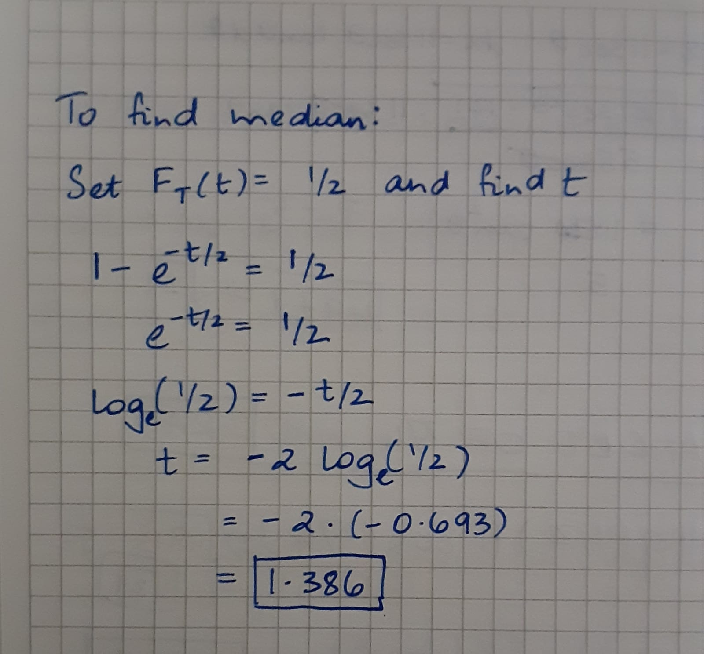
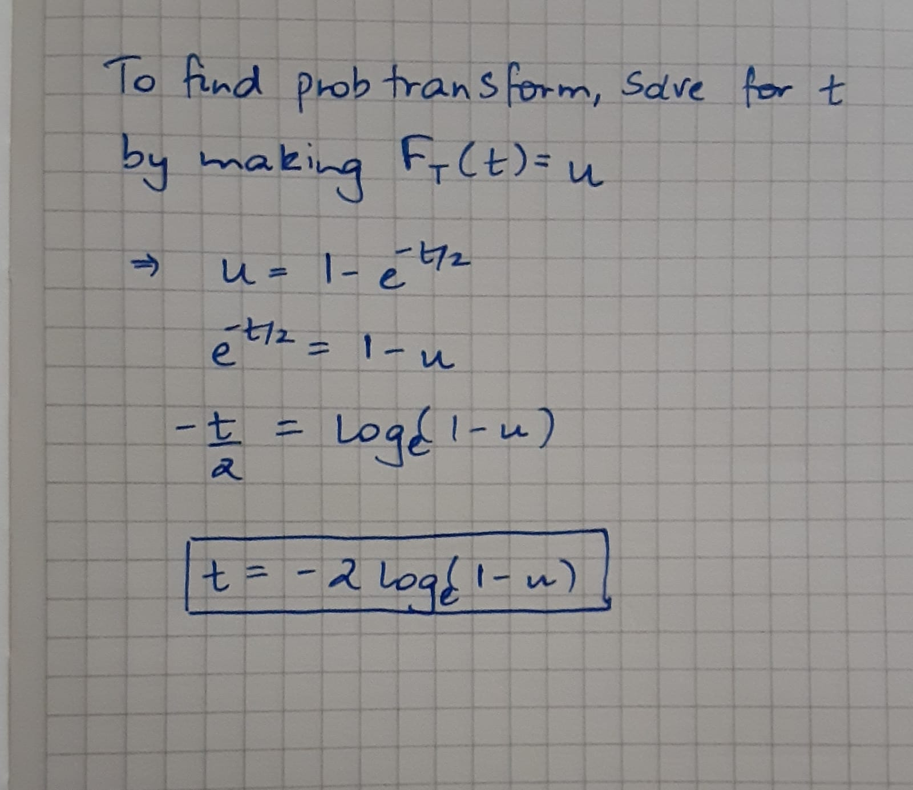

```{r setup, include=FALSE}
knitr::opts_chunk$set(echo = TRUE)
```

## g2-worksheet Random Variables and Distribution Functions

1.  The time spent waiting between events is often modeled using the exponential distribution.  For example, suppose that for a given movie the number of days in advance that customers purchase their tickets can be modeled by an exponential distribution with an average advance purchase time of 2 days.  Let $T$ be the amount of advance purchase time for customers, then $T$ is a continous random variable with the exponential distribution function $F_T(t) = 1 - e^{-t/2}.$

a.  Find the median of this distribution and explain the meaning of the value in terms of the application.

The median value in this example signifies the number of days before the event at which half of the total number of tickets have been purchased. In this case, half of the total number of tickets have been purchased approximately 1.38 days before the event.



b.  Find the probability transform for this distribution, writing $t$ as a function of $u$.

**I recommend doing parts (a) and (b) by hand and inserting a scan.**



c.  Use the probability transform you found in (b) to create 80 samples with this distribution.

```{r Random variables}
 u1 <- runif(80)
 x1 <- -2*log(1-u1) # apply your answer to (b) to u1
```

d.  Create a graph that shows the distribution function along with the CDF of the data you simulated in (c) and then perform a second simulation and add the corresponding CDF to your graph in a different color.  Label the graph in terms of the application.

```{r Second simulation and y-values}
# copy over your code from above
 u2 <- runif(80)
 x2 <- -2*log(1-u2) # apply your answer to (b) to u2

# creates 80 equispaced values in (0,1]
y <- 1:length(x1)/length(x1)
```


```{r Base R style}
# Do either this chunk or the next one.  You're probably more familiar with this
# style and the other chunk is for the adventurous.

 plot(sort(x1),      # x-values are sorted version of the data
      y,             # y-values equispaced between (0,1]
      type = "s",    # produces a stepped line
      xlim = c(0,15), # x direction goes from 0 to 2
      ylim=c(0,1),   # y direction goes from 0 to 1
      xlab="Days in advance the ticket was purchased (t)",   
      ylab="Cumulative probability of ticket purchase",
      col="blue")    # sets the color of the line to blue

# par() sets graphics options, new=TRUE tells R to plot on top of the existing plot
# if there is no existing plot then R will be very confused.
par(new=TRUE)

# For second plot use same values for xlim, ylim, xlab, and ylab.  Change col
# to a different value like "red"
plot(sort(x2),y,type = "s",xlim = c(0,15), # x direction goes from 0 to 2
      ylim=c(0,1),   # y direction goes from 0 to 1
      xlab="Days in advance the ticket was purchased (t)",   
      ylab="Cumulative probability of ticket purchase",
      col="red")

# Now let's add the distribution function
par(new=TRUE)
curve(1 - exp(-x/2),from = 0, to = 15, ylim = c(0,1), xlab = "Days in advance the ticket was purchased (t)", ylab = "Cumulative probability of ticket purchase")
```

```{r ggplot2 style}
# Try this chunk if you want a challenge and nicer looking graphs

#install.packages("ggplot2") #only needs to be run once - installs package
#library(ggplot2) # loads up ggplot2 package

# create a data frame to store our vectors in
#exp_rand_var.df <- data.frame(y = 1:length(x1)/length(x1),
#                              sx1 = sort(x1), # sorted version of x1
#                              sx2 = sort(x2)) # sorted version of x2

# and a separate data frame to store the distribution function in
# dist_function.df <- data.frame(x = seq(0,15,0.01))
# dist_function.df$y <- 1 - exp(-dist_function.df$x/2)

# https://rstudio.com/wp-content/uploads/2015/03/ggplot2-cheatsheet.pdf

# ggplot(data = data.frame) initializes the plot using this data frame
#ggplot(data = exp_rand_var.df) +
  # geom_step draws a stepped line, mapping = aes() specifies the aesthetic,
  # basically how to interpret the data in the data frame.
#  geom_step(mapping = aes(x = sx1,y = y),
#            color = "blue") +
#  geom_step(mapping = aes(x = sx2,y = y),
#            color = "red") +
#  geom_line(data = dist_function.df, mapping = aes(x = x,y = y), color = "black") +
#  xlab("???") + # insert your own labels for x- and y-axes
#  ylab("???")
```

e.  Describe how well the empirical distributions from your simulated data match $F_T(t)$.  From your graph estimate how many days away from the distribution median are the medians predicted by the two simulations of 80 data points.

We can observe that the cumulative distributive function plots are staggered compared to our distributive function which is smooth. We COULD make the CDF a bit smoother by simulating more values in our runif() function. However, we see that both of these CDF plots follow roughly the same shape as our distribution function. The horizontal distance between the graphs signifies the difference in the number of days before which the tickets were purchased, and we can see that this horizontal distance isn't large, meaning that they are quite similar.

The values at the median from the CDF and the distribution function lie roughly at the same point.The horizontal distance between the graphs when the y-value = 0.5 is quite minimal. If I were to approximate, I would say it is close to about 0.2 to 0.3 days. When we increase the probability to 0.8 or above, we see that our predictions differ from the actual distributive function by a margin of a few days even.