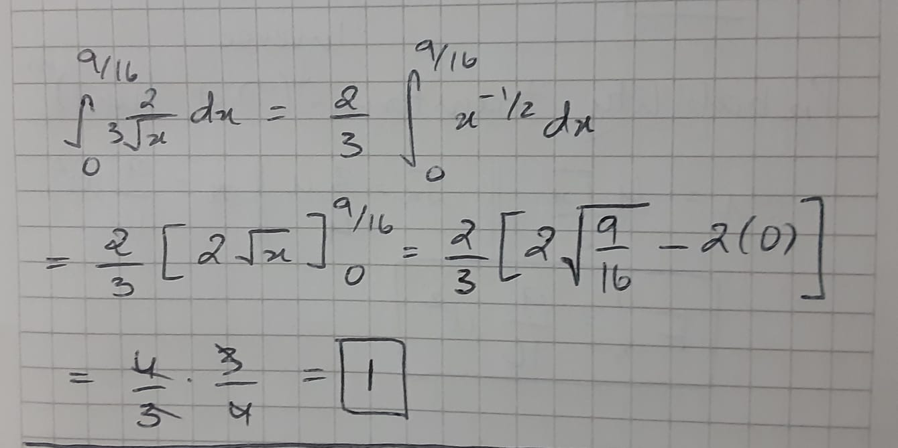
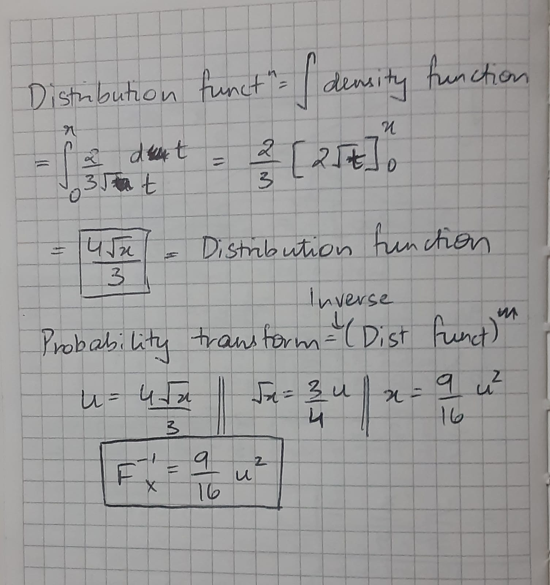
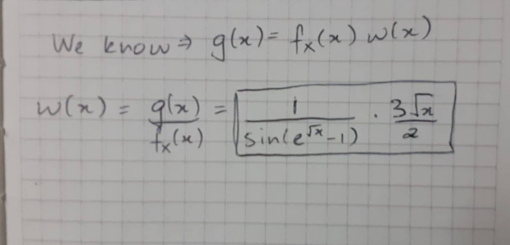

```{r setup, include=FALSE}
knitr::opts_chunk$set(echo = TRUE)
```

## j-worksheet law of Large Numbers (Monte Carlo Integration)

Consider the function $\displaystyle g(x) = \frac{1}{\sin(\exp(\sqrt{x})-1)}$ whose numerical integral from $x = 0$ to $x = 9/16$ is
```{r numerical integral}
# How to define a function in R
# function_name <- function(x) {define function here, return function value}
gx <- function(x) {
  gx <- (sin(exp(sqrt(x))-1))^-1
  return(gx)
}
integrate(gx,lower=0,upper=9/16)
```

a. Here is a plot of $g$ on the interval $(0,9/16]$.  Explain why we would expect that
importance sampling would be useful for getting an accurate measurement of our
definite integral above?

This is because g(x) changes rapidly when x tends to 0. Therefore, to get a better sense of the area under the curve, we need to weight the values of x near zero more heavily.

```{r Plot the function}
curve(gx,from=0,to=9/16,xlab="x",ylab="g(x)",n=401,ylim=c(0,25))
```

b. Use simple Monte Carlo simulation to provide 1000 estimates of  $\int_0^{9/16} g(x)\ dx$ based on a sample of 240 uniform random variables. Find the mean and standard deviation of these simulations.

```{r simple Monte Carlo}
# Write code to define your simple Monte Carlo function
set.seed(30)
simple_MC_gx <- function(n) {
  xs <- runif(n, 0, 9/16)
  simple_MC_gx <- (9/16)*mean(gx(xs))
  return(simple_MC_gx)
}

# empty vector for simulation results
int_gx_simple240 <- rep(0,1000)

for (k in 1:1000)
{
  # with each loop we use your function above to find the simple
  # MC simulation with n = 240 random variables
  int_gx_simple240[k] <- simple_MC_gx(240)
}

mean(int_gx_simple240)
sd(int_gx_simple240)
```


c. Before we can do Monte-Carlo integration with importance sampling we need a density function that has the most probability where $g(x)$ is rapidly changing and that allows us easily find a weight function (see part (e) below). Check that 
$$f_X(x) = \left\{\begin{array}{cc}
\frac{2}{3\sqrt{x}},\quad &0 < x \le 9/16,\\
0&\hbox{otherwise}
\end{array}\right.$$
is a valid density function.

For fX to be a valid density function, its integral with the given bounds should be equal to 1.




d. Find the distribution function of the function from part (c) and the corresponding probability transform.




e. If we use the density function from (c) to do importance sampling what would the weight function be? 




f. Use importance sampling to provide 1000 estimates of  $\int_0^{9/16}g(x)\ dx$ based on sample of 240 random variables with proposal density $f_X$.  Find the mean and standard deviation of these simulations.

```{r Monte Carlo with importance sampling}
# Write code to define your Monte Carlo with Importance Sampling function
importance_MC_gx <- function(n) {
  # u is a vector of probabilities that you apply your probability transform to
  u <- runif(240, 0, 1)
  # xs is a vector of RVs distributed according to your density function
  # which you get from applying the probability transform to u
  xs <- (9/16)*u^2
    
  # importance_MC_gx is your definite integral estimate from MC with importance
  # sampling
  importance_MC_gx <- mean((3/2) * sqrt(xs) * gx(xs)) # replace the 0 with your expression
  
}

int_gx_importance240 <- rep(0,1000)

for (k in 1:1000)
{
  int_gx_importance240[k] <- importance_MC_gx(240)
}

mean(int_gx_importance240)
sd(int_gx_importance240)
```


g. Find the ratio of the standard deviations of these two estimates. Which method is more likely to produce an estimate closer to the true value of the definite integral?

The Monte Carlo integration with the importance sampling gives us the better estimate. We can clearly see that the values produced using this method give us a standard deviation that is approximately 30 times lower than that given by taking the simple Monte Carlo integration.

```{r}
sd(int_gx_simple240)/sd(int_gx_importance240)
```
