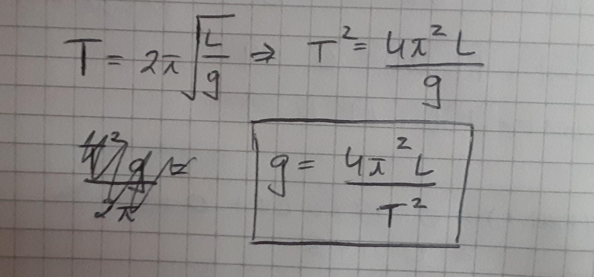
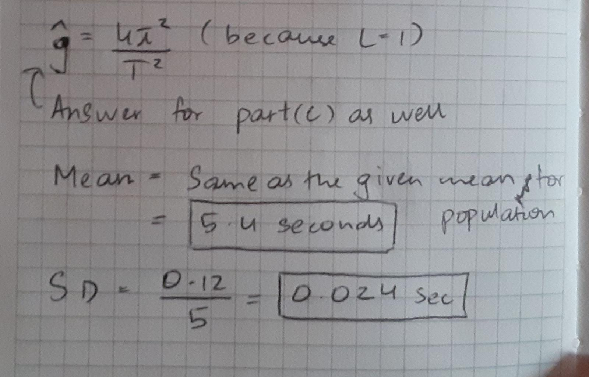
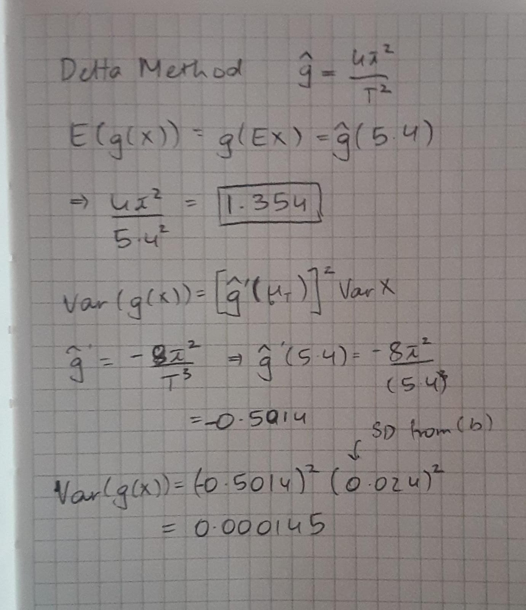

```{r setup, include=FALSE}
knitr::opts_chunk$set(echo = TRUE)
```

## k1-worksheet Delta Method

For small angles, the period, $T$, of a pendulum is
\begin{equation}
T = 2\pi \sqrt{\frac{L}{g}}.
\end{equation}
Here $L$ is the length of pendulum and $g$ is the acceleration of gravity. 

In 2005, the Huygens space probe landed on the surface of Titan. Pictures of Titan were taken with a camera designed at the University of Arizona. We will use this relationship and observations from a swinging pendulum to estimate the acceleration of gravity on the moon.


a. Give an expression for $g$ in terms of the other quantities in equation (1).



\vspace{20mm}

b. Assume that the length $L=1$ meter. Now make repeated independent measurements, $T_1, T_2, \cdots T_{25}$, of the period. If these measurements have population mean 5.40 seconds and population standard deviation 0.12 seconds, give the mean and standard deviation of $\bar T$.



\vspace{20mm}

c. Use the expression in part (a) to create an estimator $\hat g$ for $g$. Using the delta method, estimate the mean and standard deviation of $\hat g$.



\vspace{20mm}

d. Compare the mean and standard deviation of the estimates to the value given by the delta method in part (c).

We see that the value for mean, that is 1.354 is extremely close to what we have get in R. When we take the square root of our variance from (c), we get 0.01204 which again is quite close to what we got when we computed the SD in R.

```{r Simulate Delta Method}

Tbar <- rnorm(1000,mean = 5.4, sd = 0.024)
g_ests <- (4*pi^2)/(Tbar^2)

hist(g_ests)
mean(g_ests)
sd(g_ests)
```

