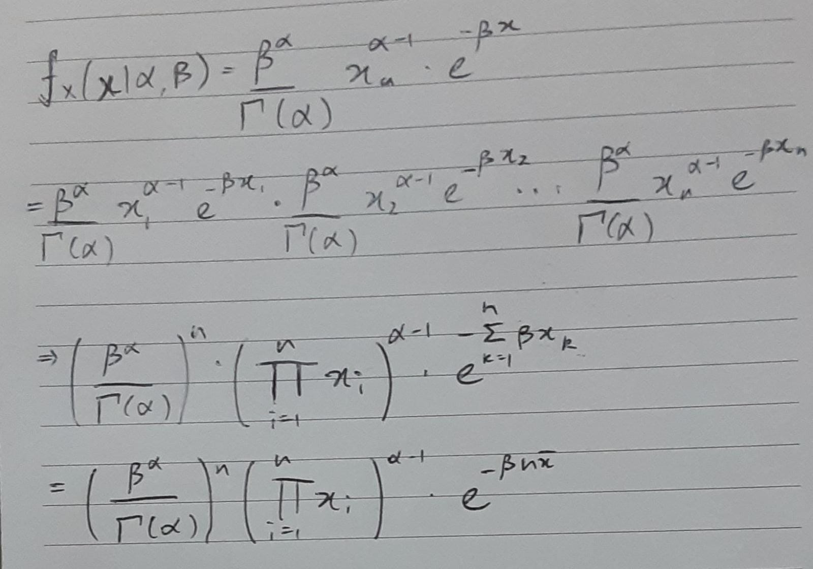

```{r setup, include=FALSE}
knitr::opts_chunk$set(echo = TRUE)
```

Checkpoint L1:



\newpage

M1 Checkpoint:

Here, we will use $\beta = 4$ to produce the simulation. 
```{r}
paretobar<-rep(0,1000)
for(i in 1:1000){u<-runif(225);
  pareto<-1/(1-u)^(1/4);
  paretobar[i]<-mean(pareto)}
betahat<-paretobar/(paretobar-1)
mean(betahat)
sd(betahat)
```


Here, we will use $\beta = 5$ to produce the simulation.
```{r}
paretobar<-rep(0,1000)
for(i in 1:1000){u<-runif(225);
  pareto<-1/(1-u)^(1/5);
  paretobar[i]<-mean(pareto)}
betahat<-paretobar/(paretobar-1)
mean(betahat)
sd(betahat)
```

