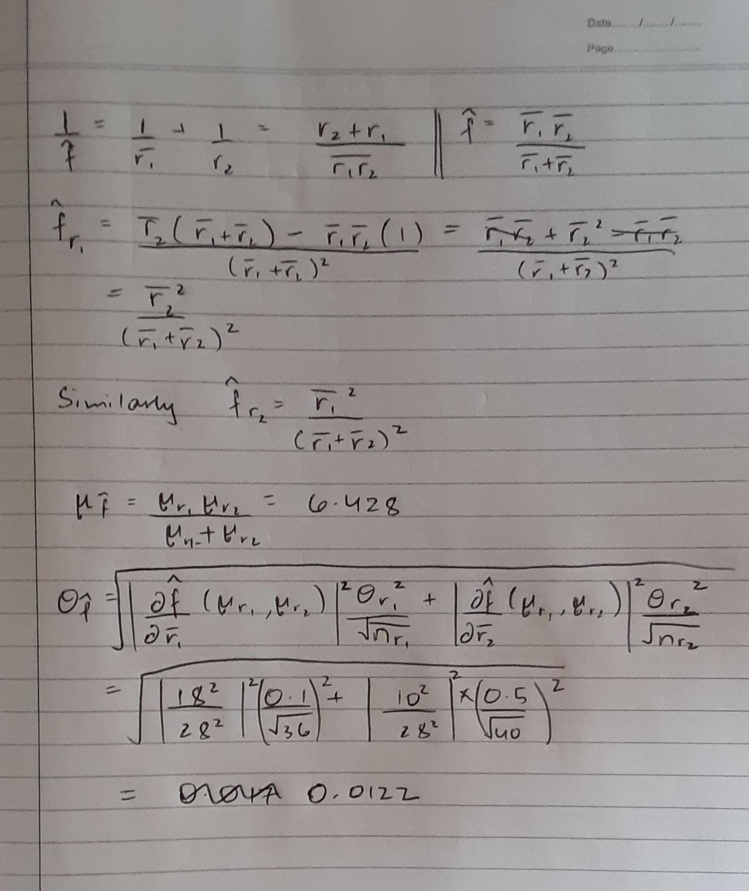

```{r setup, include=FALSE}
knitr::opts_chunk$set(echo = TRUE)
```

##  k2-worksheet

The focal length $f$ of an optical instrument is needed. This is determined by using the thin lens formula,
$$\frac{1}{r_1} + \frac{1}{r_2} = \frac{1}{f},$$ 
where $r_1$ is the distance from the lens to the object and $r_2$ is the distance from the lens to the real image of the object.  The distance $r_1$ is independently measured 36 times and $r_2$ is independently measured 40 times. The mean of the measurements is the actual distances, 10 centimeters and 18 centimeters, respectively. The standard deviation of the measurement is 0.1 centimeters for $r_1$ and 0.5 centimeter for $r_2$.

a. Let $\bar R_1$ be the sample mean of the 36 measurements to the object.  Find $\mu_{\overline{R}_1}$ and $\sigma_{\overline{R}_1}.$

The sample mean in this case is the same as the given mean which is 10 cm. The standard deviation is $\frac{0.1}{\sqrt{36}} = 0.0167$. We found this using the law of large numbers


b. Let $\bar R_2$ be the sample mean of the 40 measurements to the image. Estimate, using the central limit theorem, $P\{\bar R_2 < 17.9 \hbox{cm}\}$.

The sample mean here is 18 and the standard deviation is $\frac{0.5}{\sqrt{40}} = 0.0791$. Therefore, the z score is $\frac{17.9 - 18}{0.0791} = -1.26502$
Now $P\{\bar R_2 < 17.9 \hbox{cm}\}$ = 0.1038 (Using the table)

c. For measurements $r_{1,1},\ldots, r_{1,36}$ and $r_{2,1},\ldots, r_{2,40}$, estimate the focal length using 
$$\frac{1}{\bar r_1} + \frac{1}{\bar r_2} = \frac{1}{\hat f}.$$  Use the delta method to give an estimate of the mean and standard deviation of $\hat f$. 
How do your results from the delta method hand calculation compare to the mean and sd of the simulations below?

Here is a simulation of this protocol 10000 times using the ```rnorm``` command to simulate sample means for $r_1$ and $r_2$.

We see that the values we got for the mean and the standard deviation for $\hat f$ are quite similar to the simulated vaues.



```{r Simulation}
r1_bars <- rnorm(10000,10,0.1/sqrt(36))
r2_bars <- rnorm(10000,18,0.5/sqrt(40))

f_ests <- (r1_bars*r2_bars)/(r1_bars+r2_bars)

mean(f_ests)
sd(f_ests)
```


