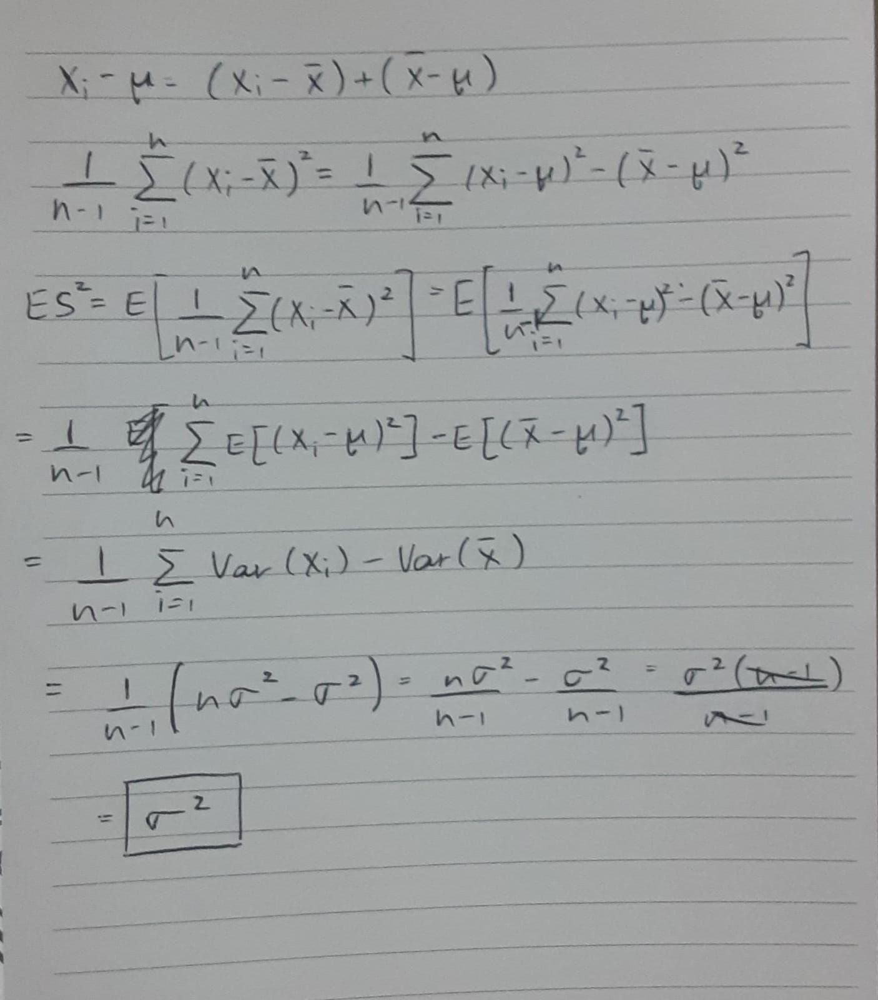

```{r setup, include=FALSE}
knitr::opts_chunk$set(echo = TRUE)
```

M2:

In the histograms for $\hat \alpha$ and $\hat \beta$, their values are prominently present around the center. If I were to choose a skew for $\hat \beta$, I would say it is a bit left skewed. The mean of $\hat \alpha$ is extremely close to the actual estimates that we found. Also, the standard deviation for $\hat \alpha$ was quite low, meaning it was a good estimate that we found. The mean for $\hat \beta$, although not as close as the estimate for $\hat \alpha$, wsa sufficiently close to the estimate mean we had found. The standard deviation in this case however, is not as low.

The correlation being 0.810 states that $\hat \alpha$ and $\hat \beta$ are strongly positively correlated. This means that $\hat \alpha$ and $\hat \beta$ are either overestimates or underestimates together, that is, if one of them is an underestimate, then it is highly likely that the other is too. This can clearly be observed in the following graph as well.

```{r}
xbar<-rep(0, 2000); x2bar<-rep(0, 2000)
for(i in 1:2000){x<-rgamma(500, 0.19, 5.18);
  xbar[i]<-mean(x); x2bar[i]<-mean(x^2)}
betahat<-xbar/(x2bar[i]-(xbar)^2)
alphahat<-betahat*xbar
plot(alphahat, betahat, xlab = "Alphahat", ylab = "Betahat", main = "Plot to compare alphahat and betahat")
```

N1:

