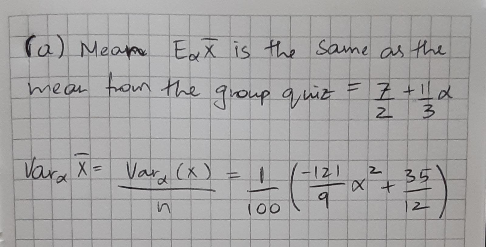
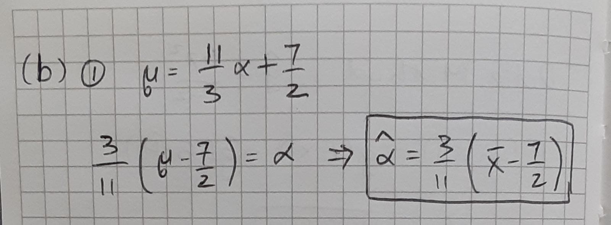
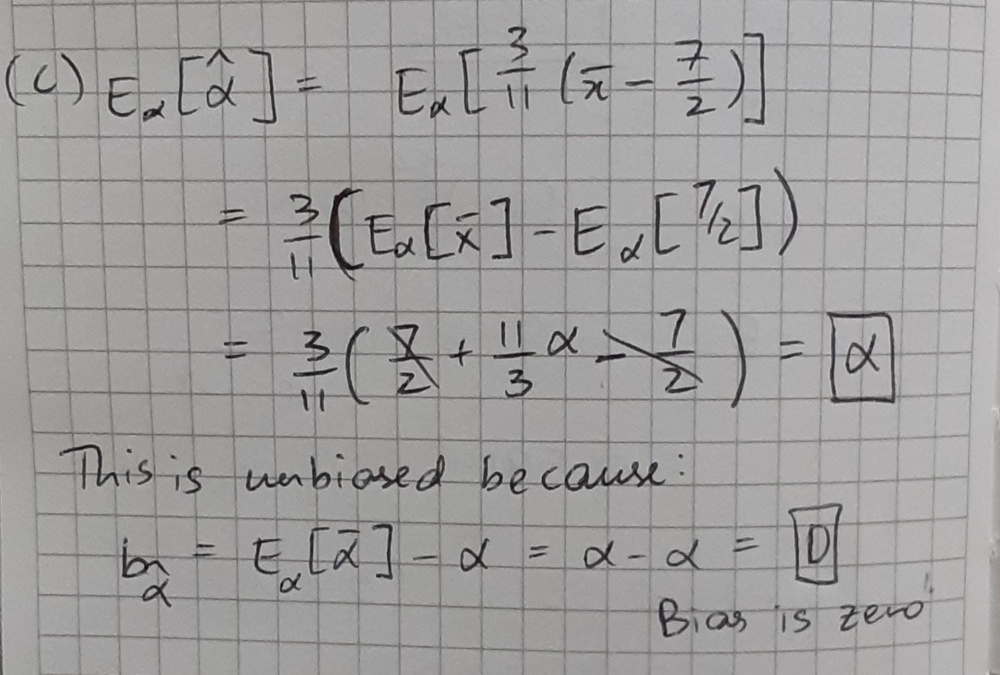
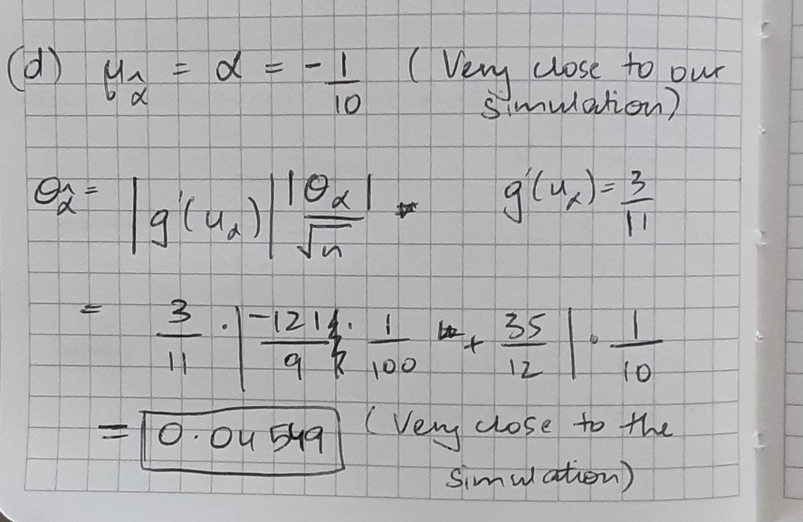

```{r setup, include=FALSE}
knitr::opts_chunk$set(echo = TRUE)
```

## m1-worksheet Method of Moments

*Assume that $X$, the value an unfair die,  has the following probability mass function.*

\begin{center}
\begin{tabular}{c|cccccc}
$x$&1&2&3&4&5&6 \\ \hline
$f_X(x|\alpha)$&$\frac{1}{6}(1-3\alpha)$&$\frac{1}{6}(1-2\alpha)$&$\frac{1}{6}(1-\alpha)$&$\frac{1}{6}(1+\alpha)$&$\frac{1}{6}(1+2\alpha)$&$\frac{1}{6}(1+3\alpha)$ \\
\end{tabular}
\end{center}

a.  Let $\bar X$ be the average of 100 dice rolls find the mean $E_\alpha \bar X$ and the variance $\text{Var}_\alpha(\bar X).$



\vspace{30mm}

b. For independent observations, $\mathbf{x} =(x_1,x_2,\ldots, x_{100})$, of this random variable from a given value of $\alpha$, give $\hat\alpha$, the method of moments estimate.



\vspace{30mm}

c. Find $E_\alpha \hat\alpha(X_1,\cdots X_{100})$. Is this estimator biased?



\vspace{30mm}

d. Find the mean and standard deviation of the estimator $\hat\alpha$ when $\alpha = -1/10$ and the sample size $n=100$. Compare to the mean and standard deviation for the 10,000 simulations shown below part (e).



\newpage

e. Below is the simulation described in part (d). Provide a description of the histogram. Roughly speaking, how likely are you to get a value within $\pm 0.1$ of the true value? Explain whether or not this is consistent with your results in part (d)?

This histogram is a normal distribution and our values are centered around the mean, that is, there is no particular right or left skewing. We can see that our standard deviation is approximately 0.045, so we are roughly 2 standard deviations on the left and the right. Therefore, we can be about 95% sure that we are within $\pm$ 0.1 of the true value.

```{r alpha hat simulations}
alpha <- -1/10
xbars <- rep(0,10000)
probs_alpha=c(1-3*alpha,1-2*alpha,1-alpha,1+alpha,1+2*alpha,1+3*alpha)/6
sum(probs_alpha)

for (k in 1:10000)
{
  xbars[k] <- mean(sample(x=c(1:6),size=100,replace=TRUE,prob=probs_alpha))
}

alpha_hats <- (3/11)*(xbars - 7/2)

mean(alpha_hats); sd(alpha_hats)

hist(alpha_hats)
```


