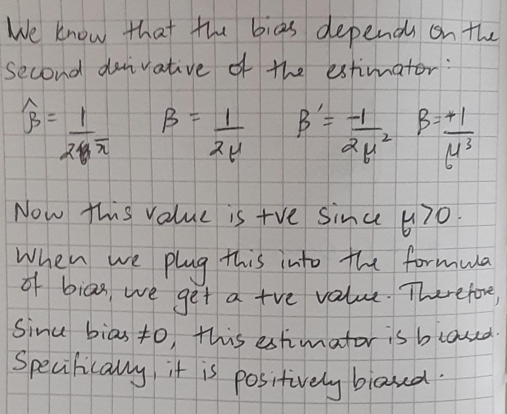
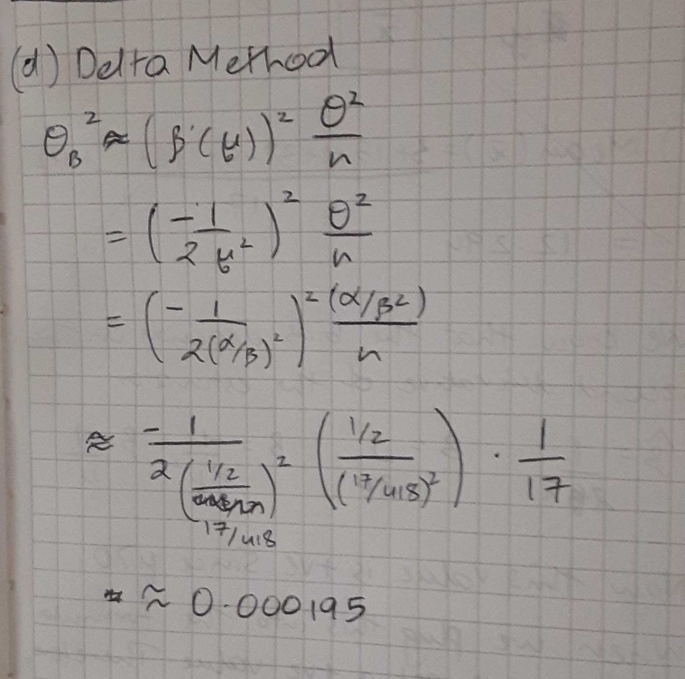

```{r setup, include=FALSE}
knitr::opts_chunk$set(echo = TRUE)
```


*Recall from the group quiz*

Daily rainfall data, in millimeters, is modeled as having a $\Gamma(1/2,\beta)$ distribution. The density is 
$$f_X(x|1/2,\beta) =  \left\{\begin{array}{ll}
0&\hbox{for}\ x\le 0,\\
\frac{\beta^{1/2}}{\sqrt{\pi}}x^{-1/2}e^{-\beta x}\quad&\hbox{for}\ x> 0.\\
\end{array}
\right.$$

*(Do Not Write Up Solutions Again)* You already found the method of moments estimator for $\beta$ based on rainfall amounts $x_1,x_2,\ldots,x_n$.  Hint:  For a $\Gamma(\alpha,\beta)$ the distributional mean is $\displaystyle \mu = \frac{\alpha}{\beta}$ and the distributional variance is $\displaystyle \sigma^2 = \frac{\alpha}{\beta^2}.$

*(Do Not Write Up Solutions Again)* You already gave the estimate $\hat\beta$ for the monsoon rainfall amounts in millimeters during July and August, 2017 for Tucson, Arizona.
\begin{center}
3\quad 15\quad  1\quad 37\quad 5\quad  1\quad  8\quad 11\quad  6\quad  9\quad 12\quad 35\quad 22\quad  3\quad 38\quad  1\quad  2\quad
\end{center}

## m2-worksheet Method of Moments

a. On a single plot, give both the empirical cumulative distribution function for the data above and the appropriate gamma distribution function.

b. Use $\hat\beta$ and the gamma distribution commands in ```R``` to estimate the probability that a monsoon rain exceeds 25 mm. Indicate this value on the plot.

```{r}
rain <- sort(c(3, 15, 1, 37, 5, 1, 8, 11, 6, 9, 12, 35, 22, 3, 38, 1, 2))
plot(sort(rain),1:17/17,type="s",
  xlim = c(0, 40), ylim = c(0, 1),
  xlab="x", ylab="Cumulative probabilities")

par(new=TRUE)

curve(pgamma(x, 0.5, 0.04067),
  xlab="", ylab="",
  xlim=c(0, 40), 
  ylim=c(0, 1),
  col = "red")

cat("The probability that a monsoon exceeds 25 mm: ", 1-pgamma(25, 0.5, 0.04067))

segments(25, 1, 25, pgamma(25, 0.5, 0.04067), col="blue", lwd=3)

```
The blue line in the graph represents the probability that a monsoon rain exceeds 25 mm. Learned the segment function by staying after class. If we were to not know how to use the segment function, this probability could be found by finding the value of the estimator for that particular value (i.e. 25) and subtracting this probability from 1, which is essentially what we did even on the graph above.

\newpage

c. Is this estimator biased? How did you reach this conclusion.


\newpage

d. Use the delta method to estimate the variance in the estimator using the value obtained for $\hat\beta$ for the  $n=17$ monsoon rainfall amounts.

