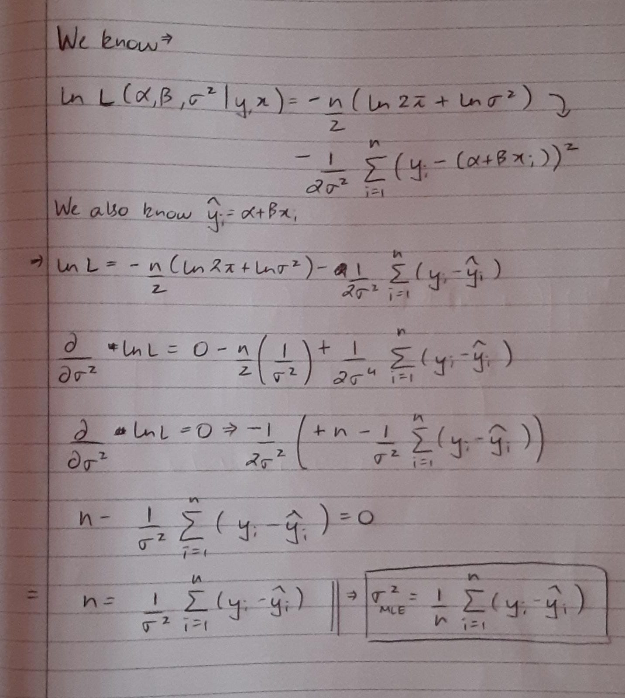

```{r setup, include=FALSE}
knitr::opts_chunk$set(echo = TRUE)
```

O2-10 Checkpoint:

{height=70%}

\newpage

P1-10 Checkpoint:

```{r}
q = qt(0.90 + (1-0.9)/2, 99)
u = 299852.4 + (q*79.01055/10)
l = 299852.4 - (q*79.01055/10)
cat("The confidence interval for 90%:", "(", u, ",", l, ")\n")

q = qt(0.98 + (1-0.98)/2, 99)
u = 299852.4 + (q*79.01055/10)
l = 299852.4 - (q*79.01055/10)
cat("The confidence interval for 98%:", "(", u, ",", l, ")\n")
```