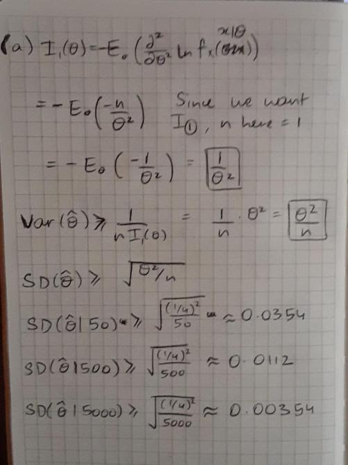

```{r setup, include=FALSE}
knitr::opts_chunk$set(echo = TRUE)
```

*(From Session 17 Group Quiz)*

For a parameter $\theta>0$, we model the accuracy of a dart player by the $Beta(\theta,1)$ density
$$f_X(x|\theta) = \left\{\begin{array}{ll}
0&\hbox{if}\ x<0, \\
\theta x^{\theta -1}\quad&\hbox{if}\ 0\le x < 1, \\
0&\hbox{if} \ 1\le x, 
\end{array}\right.$$
for a continuous random variable $X$, the distance the dart is from the center of the board.

*(Do Not Repeat Solutions)* For $n$ observations, you already found the likelihood function. 

*(Do Not Repeat Solutions)* You already found the maximum likelihood estimate for observations $x_1,\ldots, x_n$.

\vspace{1cm}
## o1-worksheet Maximum Likelihood Estimation

$\bigstar$ Consider the maximum likelihood estimates of $\hat\theta$ based on the values $\theta = 1/4$.

a. Find the formula for the standard deviation of maximum likelihood estimate of $\hat \theta$ for observations $x_1,\ldots, x_n$. Then compute the standard deviation estimate given by the Fisher information for $n=50,  500, 5000.$ What do these estimates mean?  *(Recall that $\text{SD}(\hat \theta) \approx 1 / n I_1(\theta)$ where the Fisher information can be computed via the second derivative formula.)*

These values of standard deviations are the lowest possible values that we can theoretically get with our estimators. Since this depends on our sample size n, we see that the higher our sample size, the lower the value of the lower bound becomes.



\newpage
$\bigstar$ Below are 10000 simulations of Maximum Likelihood Estimates of $\hat\theta$ based on the values $\theta = 1/4$  and $n=50,  500, 5000.$ (Note: The R-code for these simulations is in the RMD file.)

```{r 10K MLE sims, echo=FALSE}
set.seed(3)
theta <- 0.25; N <- 10000
ln_x0050_bar <- rep(0,N) # sample means of   50 beta RVs
ln_x0500_bar <- rep(0,N) # sample means of  500 beta RVs
ln_x5000_bar <- rep(0,N) # sample means of 5000 beta RVs

for (k in 1:N)
{
  ln_x0050_bar[k] <- mean(log(rbeta(  50,theta,1)))
  ln_x0500_bar[k] <- mean(log(rbeta( 500,theta,1)))
  ln_x5000_bar[k] <- mean(log(rbeta(5000,theta,1)))
}

theta_MLE0050 <- -1/ln_x0050_bar
theta_MLE0500 <- -1/ln_x0500_bar
theta_MLE5000 <- -1/ln_x5000_bar

par(mfrow=c(1,3))
hist(theta_MLE0050,main="MLE thetas (n =   50)")
hist(theta_MLE0500,main="MLE thetas (n =  500)")
hist(theta_MLE5000,main="MLE thetas (n = 5000)")
mean<-c(mean(theta_MLE0050), mean(theta_MLE0500), mean(theta_MLE5000))
sd<-c(sd(theta_MLE0050), sd(theta_MLE0500), sd(theta_MLE5000))
data.frame(Mean=mean, StandDev=sd, row.names = c("MLE n=50","MLE n=500","MLE n=5000"))
```

b. Discuss what happens to the bias, standard deviation, and shape of the distributions of $\hat\theta$s as $n$ gets large in the context of the Asymptotic Properties of Maximum Likelihood Estimators.

We see that as the value of n increases, the shape of the graphs become more and more normal. Moreover, the skewness of the graph is also decreasing. Now since the skewness of the graph is decreasing, we know that the bias of the graph will also decrease. In terms of the Asymptotic properties: the graph is CONSISTENT since as the value of n grows larger, the value of the mean converges to value of the population mean, i.e., 1/4. We have Asymptotic NORMALITY since the graph is growing less and less skewed, meaning the value of bias is also reducing. Finally, we also have asymptotic EFFICIENCY since the spread of the data, that is the standard deviation is growing smaller and smaller. 

\newpage
$\bigstar$ Below are 10000 simulations of the Method of Moments estimates of $\hat\theta$ based on the values $\theta = 1/4$  and $n=50,  500, 5000.$ (Note: The R-code for these simulations is in the RMD file.)

```{r 10K method of moments sims, echo=FALSE}
set.seed(4)
theta <- 0.25; N <- 10000
xbars0050 <- rep(0,N) # sample means of   50 beta RVs
xbars0500 <- rep(0,N) # sample means of  500 beta RVs
xbars5000 <- rep(0,N) # sample means of 5000 beta RVs


for (k in 1:N)
{
  xbars0050[k] <- mean(rbeta(  50,theta,1))
  xbars0500[k] <- mean(rbeta( 500,theta,1))
  xbars5000[k] <- mean(rbeta(5000,theta,1))
}

theta_MoM0050 <- xbars0050/(1-xbars0050)
theta_MoM0500 <- xbars0500/(1-xbars0500)
theta_MoM5000 <- xbars5000/(1-xbars5000)

par(mfrow=c(1,3))
hist(theta_MoM0050,main="MoM thetas (n =  50)")
hist(theta_MoM0500,main="MoM thetas (n =  500)")
hist(theta_MoM5000,main="MoM thetas (n = 5000)")
mean<-c(mean(theta_MoM0050), mean(theta_MoM0500), mean(theta_MoM5000))
sd<-c(sd(theta_MoM0050), sd(theta_MoM0500), sd(theta_MoM5000))
data.frame(Mean=mean, StandDev=sd, row.names = c("MoM n=50","MoM n=500","MoM n=5000"))
```

c. Compare the Maximum Likelihood Estimates simulations used in part (b) with the equivalent Method of Moments simulations above.  How do these results explain why Maximum Likelihood Estimation is preferred to Method of Moments for parameter estimation?

We can see that as the value of n increases, both the simulations show a decrease in the skewness of the distribution. Both of them are a bit skewed initially, but as the value of n increases, this skewness is seen to reduce significantly. Most importantly however, these simulations differ in terms of the values of standard deviations for different values of n. We can see that with the Maximum Likelihood Estimates, the values of the standard deviations are much lower compared to the values we got in the Method of moments simulation. Therefore, since the value of spread is less in the MLE simulation, this is a much more powerful estimator as compared to the MoM estimator.