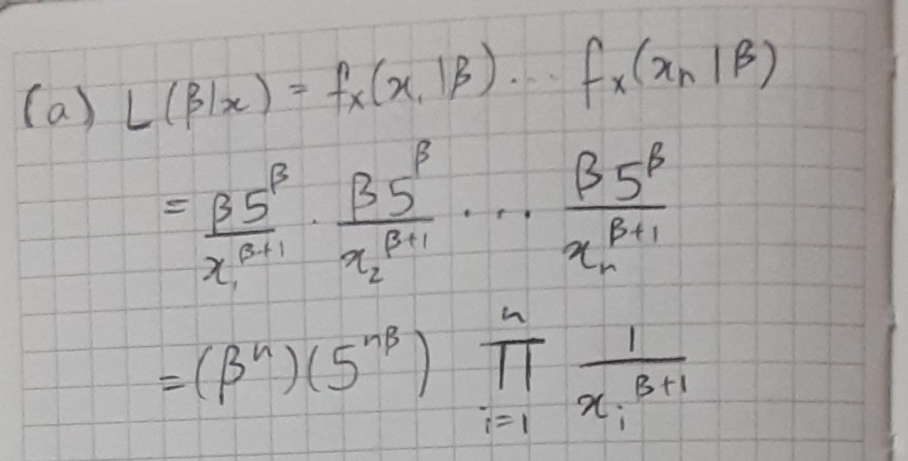
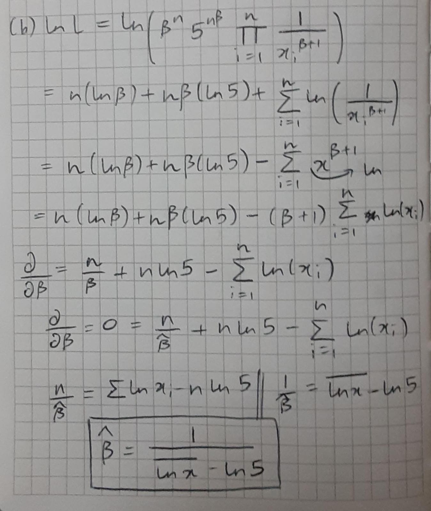

```{r setup, include=FALSE}
knitr::opts_chunk$set(echo = TRUE)
```

## o2-worksheet Maximum Likelihood Estimation

1. Loss of property for insurance purposes is sometimes modeled as a Pareto distribution. An insurance company offiers two insurance policy. If we take the claim amounts (in thousands of dollars), this yields a density of
$$f_X(x|\beta) =\frac{\beta 5^\beta}{x^{\beta+1}}, \quad x \ge 5.\quad \rm{with\ mean}\ \mu_X = \frac{5\beta}{\beta-1} \quad \rm{and\ standard\ deviation}\ \sigma_X=\frac{5}{\beta-1}\sqrt{\frac{\beta}{\beta-2}}$$
for a minimum claim of 5 thousand dollars. 

a. Give the likelihood function for $n$ independent claims for the first insurance policy.



\newpage

b. Find the maximum likelihood estimate $\hat\beta$ for $\beta$ in terms of claims $x_1,x_2,\ldots,x_n$.

{height=70%}

\newpage

c. The claims for the insurance policies can be downloaded with the commands

```{r read claims}
claims<-read.csv("http://math.arizona.edu/~jwatkins/claims5.csv")[,1]
```
\qquad for claim data under the insurance policy. Give the maximum likelihood estimate for these data.

Mean of ln(x) = 1.853

Now we know that $\hat \beta = \frac{1}{\bar{\ln x}-\ln 5}$

$\hat \beta = \frac{1}{1.853 - \ln 5}$

$\hat \beta = 4.10573$


\vspace{0.5cm}

d. Use the estimated parameter value to estimate the mean and standard deviations of the claims. How well does this match the values from the data?

Estimated Mean= $\frac{5\hat \beta}{\hat \beta-1} = 6.6099$
Estimated standard deviations = $\frac{5}{\hat \beta-1}\sqrt{\frac{\hat \beta}{\hat \beta-2}} = 2.248$

```{r}
(mean(claims))
(sd(claims))
```
The values of the estimated mean and the actual values of the mean and standard deviations can be seen to be quite close to each other. The estimated mean is slightly less than the actual value while the estimated standard deviation is a bit higher than the actual standard deviation.
