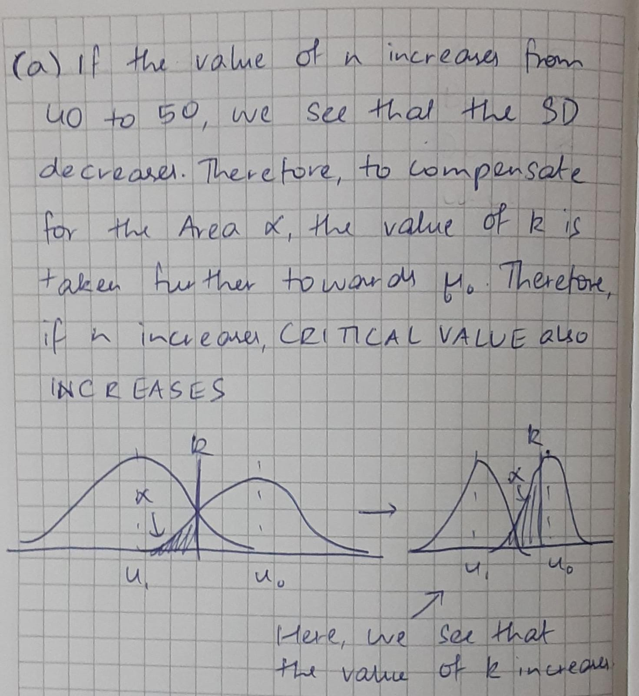
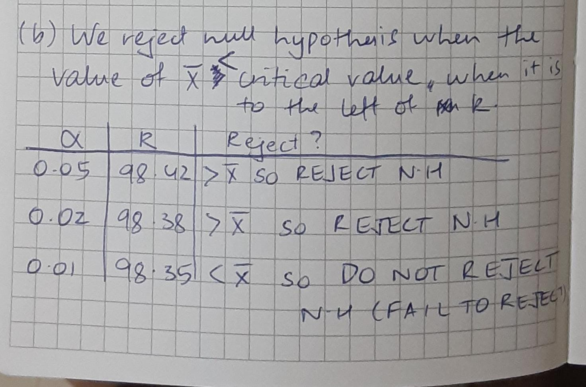

```{r setup, include=FALSE}
knitr::opts_chunk$set(echo = TRUE)
```

*(Session 19 Group Quiz)*

The body temperature in degrees Fahrenheit of $n=40$ randomly chosen healthy adults is measured. The standard deviation $\sigma$ is known to be 0.68 degrees Fahrenheit. The sample mean for the measurements is $\bar x=98.37$.


*(Do Not Repeat Solutions)* You already found a 99\% confidence interval for the mean body temperature and explained its meaning.

*(Do Not Repeat Solutions)* Consider the simple hypothesis for the mean body temperature in degrees Fahrenheit, 
$H_0: \mu=98.6\quad\mbox{versus}\quad H_1:\mu=98.4.$
You already gave the critical value for $\bar x$, the sample mean body temperature when the significance level  $\alpha=0.05,0.02$, and 0.01.

## q-worksheet

a. Do these critical values increase, decrease, or stay the same in the number of healthy adults chosen increases to $n=50$? Explain your answer.


\newpage

b. The data have sample mean $\bar x = 98.37$. For $n=40$ and each value of $\alpha$, report whether or not we reject the null hypothesis? Explain your answer.



\newpage

c.  Find the power of the test in part (b) for each significance level.
\begin{center}
\begin{tabular}{c||ccc}
&\multicolumn{3}{c}{significance} \\ 
&0.05&0.02&0.01 \\ \hline
power&&&\\
\end{tabular}
\end{center}

```{r}
z1<-(98.42315 - 98.4)/(0.68/sqrt(40))
z2<-(98.37919 - 98.4)/(0.68/sqrt(40))
z3<-(98.34988 - 98.4)/(0.68/sqrt(40))
cat("Value of power for alpha = 0.05: ", pnorm(z1), "\n")
cat("Value of power for alpha = 0.02: ", pnorm(z2), "\n")
cat("Value of power for alpha = 0.01: ", pnorm(z3), "\n")
```

\newpage

d. For $\alpha = 0.01$, indicate the power using the critical value for the test and drawing the density of the sample mean $\bar X$ for the null and alternative hypothesis.

```{r}
curve(dnorm(x, mean = 98.4, sd = 0.68/sqrt(40)), from = 97.9, to = 99.1, col = "red")
par(new = TRUE)
curve(dnorm(x, mean = 98.6, sd = 0.68/sqrt(40)), from = 97.9, to = 99.1)
abline(v = 98.35)
```

The shaded area indicated on the next page is the power, that is, the area to the left of the critical value under the curve for the alternative hypothesis.


