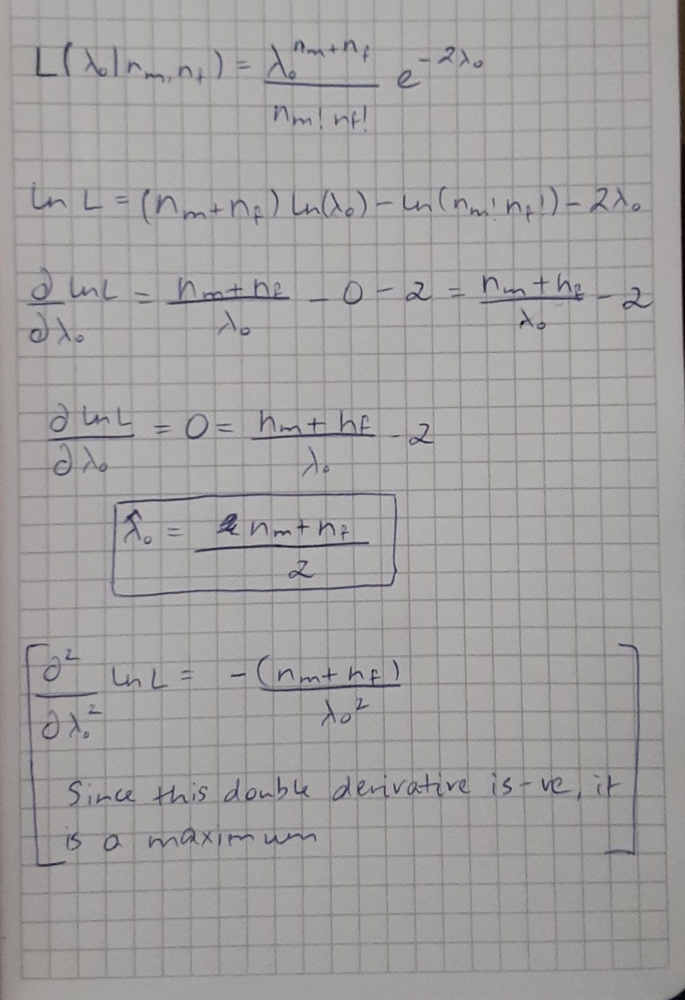

```{r setup, include=FALSE}
knitr::opts_chunk$set(echo = TRUE)
```

S2-10

1. The 95% confidence interval for the difference in proportions is [0.006942351, 0.163081746]. This doesn't contain the value 0.

```{r}
prop.test(c(250, 167), c(332, 250), conf.level = 0.98)
```

2. The 98% confidence interval for the difference in proportions is [-0.006996134, 0.177020231]. This DOES contain the value 0.

3. The p-value in both cases is the same, that is, 0.0308. This is because the data that we provide in both cases was the same. The 98% interval contains 0 because the size of the interval is larger, and since the 95% interval was already very close to zero, the 98% interval covers just a little larger radius, thereby incorporating the value 0 into the interval.

4. A more severe winter must have less than 75.3012% hives surivive it.
H0 : p2 >= 0.753012, that is, the survival rate of the hives in the second winter is greater than or equal to
the rate in the first winter, which was 250/332.
H1 : p2 < 0.753012, that is, the second winter was more severe.

```{r}
prop.test(c(250, 167), c(332, 250), alternative = c("less"))
```
Here, we can see that the p-value is 0.9846 which is quite high. This means that it is highly likely for the second winter to have a survival rate of 66.8% (as indicated by p2 = 66.8%).


S2-12

```{r}
# The original test with alpha = 0.05
power.prop.test(n=c(250, 350, 450, 550),
p1=0.7, p2=0.6, sig.level = 0.05,
alternative = c("one.sided"))

# Now the modified test with the value of alpha = 0.02
power.prop.test(n=c(250, 350, 450, 550),
p1=0.7, p2=0.6, sig.level = 0.02,
alternative = c("one.sided"))
```
```{r}
# To calculate the difference in powers
c(0.7589896, 0.8717915, 0.9342626, 0.9672670) - c(0.6148167, 0.7653872, 0.8637122, 0.9237709)
```
We see that there is quite a significant decrease in power when we go from alpha = 0.05 to 0.02. We can also notice that as the sample size increases, the difference between the 2 reduces. The power decreases since when we decrease alpha, the critical value increases. meaning the probability to get a Type II error increases. Therefore, since it is more likely to get a Type II error, the power decreases.

\newpage

S3-8

{height=70%}