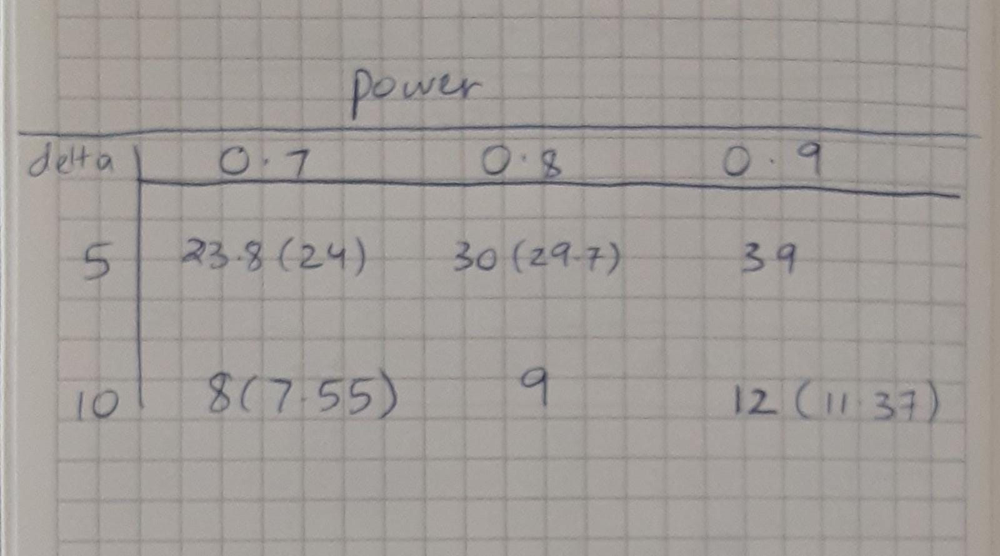
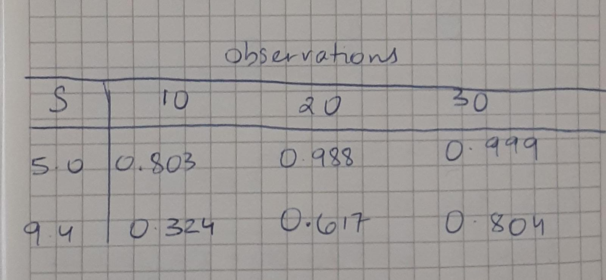

```{r setup, include=FALSE}
knitr::opts_chunk$set(echo = TRUE)
```

T1-11

```{r}
radon<-c(91.9, 97.8, 111.4, 122.3, 105.4, 95.0, 103.8, 99.6, 96.6, 119.3, 104.8, 101.7)

# I will be using this function for (1) but changing the values accordingly
power.t.test(power=0.70, delta=10, sd=sd(radon), type=c("one.sample"))

# I will be using this function for (2) but changing the values accordingly
power.t.test(n=10, delta=5, sd=9.40, type=c("one.sample"))
```

(1) 


Note: In this part, the values in the bracket are the exact measurements found, while the values outside the brackets are the practically applicant values which are rounded up for real-world use since we can't have a fractional number of observations.

(2)


(3) The 2 extreme values in the first table are n = 8 (or 7.55) and n = 39. A large gap (delta) between the null hypothesis and the alternative hypothesis means that type II error is naturally low, and thus a high power can be achieved with a tiny sample size. Note that more power, even at a high delta, requires more observations. In the same vein, a small delta paired with a large power requires a much larger number of observations.

In the second table, the values pow=0.324 and pow=0.999 are the most extreme; a small sd naturally reduces the spread and thus the type II error, and a large n helps in that as well, which causes a very high power in the first row, third column. When sd is high (or in this case, realistic), and we are limited to a small number of observations, the power is low.

\vspace{1cm}

T2-10

```{r}

# The answer to the first part of the checkpoint
mosquitoes<-read.csv("mosquitoes.csv")
t.test(mosquitoes$transgenic, mosquitoes$wildtype, alternative = c("less"), conf.level = 0.98)
```

(2) When the confidence interval includes zero, we fail to reject the null hypotheses conclusion that the difference of proportions is zero. Therefore, in this case since the 98% confidence interval does contain 0, we would fail to reject the null hypothesis at the 2% level using the two-sided hypothesis test.

(3) The p-value for a one-sided test will be twice the p-value for a 2 sided test. In this case, this p-value for a one-sided test will be 0.016994