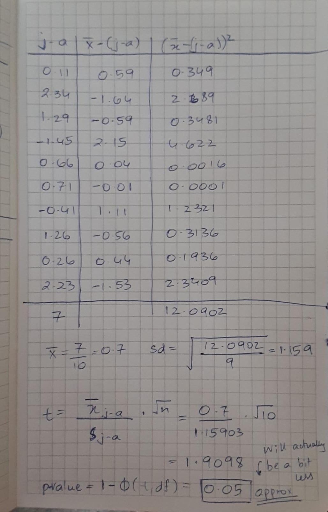

```{r setup, include=FALSE}
knitr::opts_chunk$set(echo = TRUE)
```

*(Session 22 Group Quiz)*

July and August are the strongest months for monsoon rains in Tucson. Your friend suspects that more rain takes place in July.

*(Do Not Repeat Solutions)* You have already stated a hypothesis appropriate to your friend's suspicion.

*(Do Not Repeat Solutions)* For the years 2007 to 2016, here are the data for rainfall total in inches. 
\begin{small}
\begin{center}
\begin{tabular}{c|ccccccccccc}
&2007&2008&2009&2010&2011&2012&2013&2104&2015&2016 \\ \hline
July&4.38&4.03&2.15&1.44&1.69&0.71&1.44&4.58&2.06&3.32 \\ 
August&4.27&1.69&0.86&2.89&1.03&0.00&1.85&3.32&1.80&1.09
\end{tabular}
\end{center}
\end{small}

You have already determined the test procedure that you will use in this case.

\vspace{5mm}

## t-worksheet t-procedures

a.  Compute the appropriate $t$ statistics for the hypothesis stated in the quiz.  Show the calculation you would do by hand and show the command to do this in ```R```.



```{r t test}
#The data has been entered for you!
july <- c(4.38,4.03,2.15,1.44,1.69,0.71,1.44,4.58,2.06,3.32)
august <- c(4.27,1.69,0.86,2.89,1.03,0.00,1.85,3.32,1.80,1.09)

# Command to perform this test in R
t.test(july, august, paired = TRUE, alternative = "greater")
```

b.  What is the conclusion concerning your hypothesis? Use you answer in part (a) to explain your conclusion.

When we perform the test, we see that the p-value that we get is 0.04424. This means that we can reject the null hypothesis since the p-value is 0.044 which is less than our alpha which is 0.05


c. If you incorrectly used the two-sample $t$ procedure, how  does the $p$-value change?

If we incorrectly use the two-sample t procedure, i.e., do not specify paired = TRUE, then the p value that we get will be significantly higher than the correct test.This means that it will be much harder to reject the null hypothesis. This is because we are not making use of the fact that the variables are actually matched. Since we are essentially discarding an important identity of the data, this makes the test much weaker. Therefore, since we are ignoring the fact that the variables are matched, the p-value we get will be significantly higher than before.

```{r two sample test}
t.test(july, august, alternative = "greater")
```

