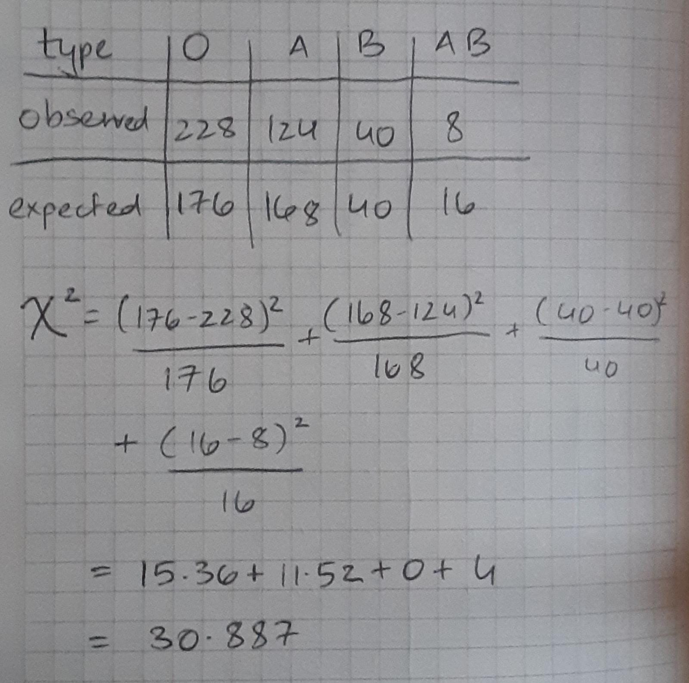

```{r setup, include=FALSE}
knitr::opts_chunk$set(echo = TRUE)
```

U1-13:

{height=70%, width=70%}

```{r}
# We see that this is the same as the value from the slides
(1 - pchisq(30.8874, df=3))
```

U2-9:

Degrees of freedom = (no. of rows - 1) $\times$ (no. of columns - 1) = 2 $\times$ 1 = 2

$\chi^2 = \frac{(332.49 - 400)^2}{332.49} + \frac{(1447.51 - 1380)^2}{1447.51} + \frac{(418.22 - 416)^2}{418.22} + \frac{(1820.78 - 1823)^2}{1820.78} + \frac{(253.29 - 188)^2}{253.39} + \frac{(1102.71 - 1168)^2}{1102.71}$

$\chi^2 = 37.559$