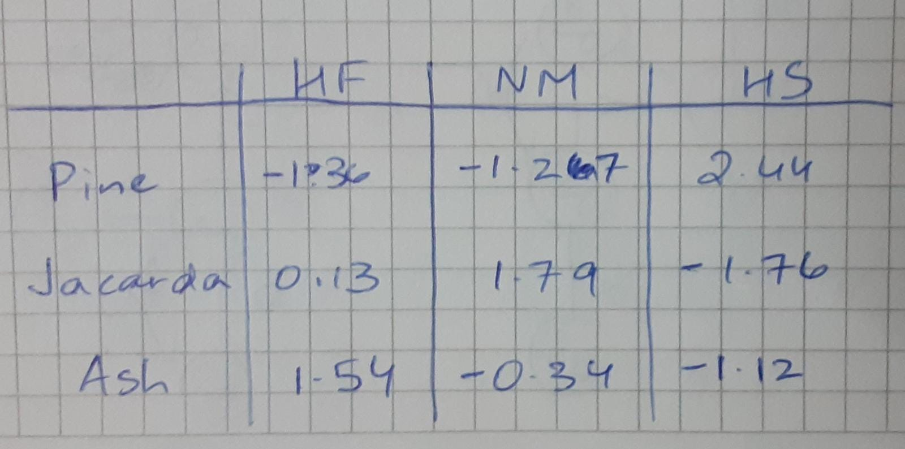

```{r setup, include=FALSE}
knitr::opts_chunk$set(echo = TRUE)
```

*(Session 23 Group Quiz)*

Three streets in Los Angeles have different tree types - pine, jacaranda, and ash. Counts of three common bird species- house finch, northern mockingbird, and house sparrow -  are taken on each of the three streets. Below are are table of counts. Are the bird species preferences independent of the street?

```{r bird counts}

bird_counts <- matrix(data = c(9,11,14,9,16,8,26,6,7),ncol=3)
row_names <- c("pine","jacaranda","ash")
col_names <- c("house finch","northern mockingbird","house sparrow")
dimnames(bird_counts) <- list(row_names,col_names)
bird_counts
```

*(Do Not Repeat Solutions)* You already gave a suitable hypothesis to address the question addressed above.

*(Do Not Repeat Solutions)* You already created the ``expected" table.

\vspace{10mm}

## u-worksheet Chi-Squared

a. Create the table of residuals.



\newpage

b. Show how you would compute the $\chi^2$ test statistic from the residual table.

We would simply find the sum of the squares of all the entries on the residual table.

$\chi^2 = (-1.36)^2 + (-1.27)^2 + (2.44)^2 + (0.13)^2 + (1.79)^2 + (-1.76)^2 + (1.54)^2 + (-0.34)^2 + (-1.12)^2$

$\chi^2 = 19.47$

c. Use ```R``` to perform the $\chi^2$ test and state your result.

```{r}
chisq.test(bird_counts)
```

Here we see that since the p-value we receive is quite small, this means that we can reject the Null Hypothesis, meaning that there is SOME relationship between birds and the trees (or streets) they prefer.

d. Make a segmented bar chart of the conditional distribution of bird species, comparing the three streets.

```{r}
barplot(bird_counts, legend.text = row_names,
        ylim = c(0, 50),
        args.legend = c(x=1.05, y=50))
```

e. Use the table of residuals to state which trees to plant to attract more of each species of birds -  house finch, northern mockingbird, and house sparrow. Explain your answer.

The rows with the highest value of the residual in a particular bird's column would attract that bird the most. Therefore, the Pine tree would attract the House Sparrow the most, the Jacarda would attract the Northern Mockingbird the most and the Ash tree would attract the House Finch the most.
