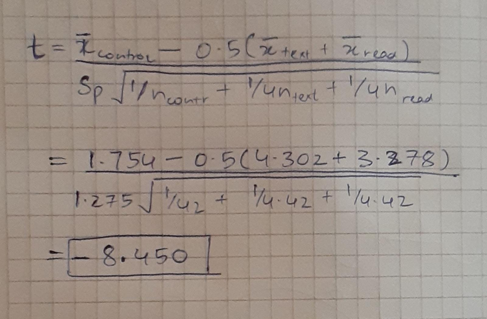

```{r setup, include=FALSE}
knitr::opts_chunk$set(echo = TRUE)
```

*(Session 24 Group Quiz)*

In a 2011 study from Texas A \& M University, forty-two drivers were placed behind the wheel of a car and drove around a closed track about 11 miles in length. The researchers monitored how long it took drivers to react to a flashing light while driving normally and while attempting to text or to read a message on a mobile phone. Here is a summary of the data.

\begin{center}
\begin{tabular}{|c|ccc|}\hline
&&&standard \\
conditions&\# observations&mean&deviation \\ \hline
control&42&1.754&0.806 \\
texting&42&4.302&1.614 \\
reading&42&3.278&1.274 \\ \hline
\end{tabular}
\end{center}

*(Do Not Repeat Solutions)* You already gave the appropriate hypothesis for this situation.

*(Do Not Repeat Solutions)* You already showed the hand calculation of the $F$ statistic for a one way analysis of variance and included the details for the SSG, SSE, DFG, DFE.

\vspace{5mm}

## v-worksheet -  Anaylsis of Variance

a. Give the $p$-value for the test. What are you conclusions?

```{r}
pf(42.465, df1 = 2, df2 = 123, lower.tail = FALSE)
```
Since our p-value is extremely small, we can reject the null hypothesis. This means that at least one of the mean values is statistically different.

b. Give a 95\% confidence interval for the difference in mean reaction times between texting and control and between reading and control.

```{r}
tstar<-qt(0.975, 123)
sp<-sqrt(199.986/123)

mean_text <- 4.302
mean_read <- 3.278
mean_control <- 1.754

c1_lo <- (mean_text - mean_control) - tstar * sp * sqrt(1/42 + 1/42)
c1_hi <- (mean_text - mean_control) + tstar * sp * sqrt(1/42 + 1/42)

c2_lo <- (mean_read - mean_control) - tstar * sp * sqrt(1/42 + 1/42)
c2_hi <- (mean_read - mean_control) + tstar * sp * sqrt(1/42 + 1/42)
```

Confidence interval for difference in means between texting and the control group is ( 1.997218 , 3.098782 )
Confidence interval for difference in means between texting and the control group is ( 0.9732181 , 2.074782 )

c. Give a hypothesis for the contrast that compares the control to the average of the mean times for texting and reading.

$H_0: \mu_{control} = 0.5(\mu_{texting} + \mu{reading})$
The mean for the control group is equal to the average of the means of the texting group and reading groups

$H_1: \mu_{control} \neq 0.5(\mu_{texting} + \mu{reading})$
The mean for the control group is not equal to the average of the means of the texting group and reading groups


d. Give the value of the $t$-statistic for this test. What are the degrees of freedom?



The degrees of freedom are the same as DFE = 123

e. Do you reject this hypothesis? Explain what this means in the context of the application.

```{r}
pt(-8.450, df=123, lower.tail = TRUE) * 2
```
Once again, since the p-value is very small, we can reject the null hypothesis. This would mean that there is a difference between the mean reaction time for the control group and the average mean of the texting and reading group.
